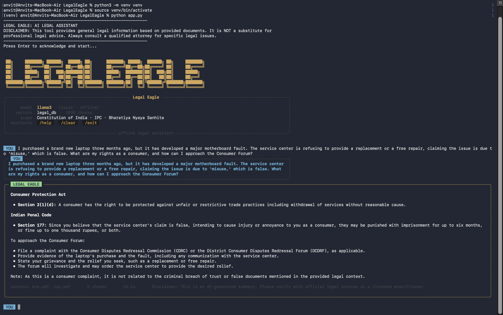
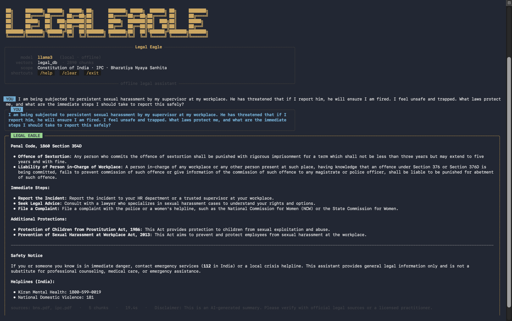

<div align="center">


<!-- LEGAL EAGLE ASCII - renders in monospace environments like terminal READMEs -->

```
             ██╗     ███████╗ ██████╗  █████╗ ██╗      ███████╗ █████╗  ██████╗ ██╗     ███████╗
             ██║     ██╔════╝██╔════╝ ██╔══██╗██║      ██╔════╝██╔══██╗██╔════╝ ██║     ██╔════╝
             ██║     █████╗  ██║  ███╗███████║██║      █████╗  ███████║██║  ███╗██║     █████╗
             ██║     ██╔══╝  ██║   ██║██╔══██║██║      ██╔══╝  ██╔══██║██║   ██║██║     ██╔══╝
             ███████╗███████╗╚██████╔╝██║  ██║███████╗ ███████╗██║  ██║╚██████╔╝███████╗███████╗
             ╚══════╝╚══════╝ ╚═════╝ ╚═╝  ╚═╝╚══════╝ ╚══════╝╚═╝  ╚═╝ ╚═════╝ ╚══════╝╚══════╝
```


<p>
  
  
  
  
  
</p>

<p>
  
  
  
  
</p>

<br/>

> ### `100% Offline · Zero API Cost · Zero Telemetry · Hallucination-Resistant`
>
> *Ask questions about Indian law. Get grounded, section-cited answers — entirely from a local model running on your machine.*

<br/>

</div>

---

## 🦅 What is Legal Eagle?

Legal Eagle is a **production-grade offline RAG (Retrieval-Augmented Generation) system** built for Indian law. It indexes 620+ pages of legal documents — the Indian Constitution, IPC, and Bharatiya Nyaya Sanhita — into a local ChromaDB vector store and answers questions using a locally running **Llama 3** model via Ollama.

**No cloud. No API keys. No data leaves your machine.**

The CLI is inspired by modern coding terminals like Claude Code: color-coded role panels, streaming markdown answers, live spinners during retrieval, and syntax-highlighted output — all running entirely offline.

---

## 📸 Screenshots

<br/>

**Consumer Rights Query — Live Session**



> A real-world query about a faulty laptop and Consumer Forum rights — answered with precise citations from BNS and IPC in under 20 seconds, entirely offline.

<br/>

**Workplace Harassment — Safety-Aware Response**



> Sensitive queries auto-trigger a **Safety Notice** with Indian emergency helplines (112 · Kiran · NCW 181), in addition to full legal citations from POSH Act 2013 and IPC Section 354D.

---

## 🏗️ Architecture

```
    ╔══════════════════════════════════════════════════════════════════╗
    ║                        USER QUERY (CLI)                          ║
    ║               app.py · REPL · slash commands                     ║
    ╚══════════════════════════╦═══════════════════════════════════════╝
                               ║
                  ┌────────────▼────────────┐
                  │    Safety Filter        │  ← auto-appends helplines
                  │    Greeting Shortcut    │  ← skips RAG for hi/thanks
                  └────────────┬────────────┘
                               │
                  ┌────────────▼────────────┐
                  │   LangChain LCEL Chain  │
                  │   RunnableParallel      │
                  │   context ──► retrieve  │
                  │   question ──► passthru │
                  └────────┬────────────────┘
                           │
             ┌─────────────▼──────────────────┐
             │          retriever.py          │
             │   ChromaDB · MMR · k=5         │
             │   fetch_k=20 · λ=0.5           │
             │   nomic-embed-text embeddings  │
             └─────────────┬──────────────────┘
                           │
             ┌─────────────▼──────────────────┐
             │        legal_db/               │
             │   constitution.pdf  · ~250p    │
             │   ipc.pdf           · ~190p    │
             │   bns.pdf           · ~183p    │
             │   2,999 indexed chunks         │
             └─────────────┬──────────────────┘
                           │ retrieved context
             ┌─────────────▼──────────────────┐
             │   Llama 3 (via Ollama)         │
             │   temp=0.1 · streaming=True    │
             │   grounded · section-cited     │
             └─────────────┬──────────────────┘
                           │ token stream
             ┌─────────────▼──────────────────┐
             │           ui.py                │
             │   Rich panels · Markdown       │
             │   Live streaming · Spinner     │
             │   Source footer · Disclaimer   │
             └────────────────────────────────┘
```

---

## 📚 Legal Coverage

| Document | Coverage | Chunks | Pages |
|:---|:---|:---:|:---:|
| 🇮🇳 Indian Constitution | All Articles + Amendments | ~980 | ~250 |
| ⚖️ Indian Penal Code (IPC) | All Sections | ~740 | ~190 |
| 📜 Bharatiya Nyaya Sanhita (BNS) | Full Text | ~710 | ~183 |
| **Total** | **620+ pages of Indian law** | **~2,999** | **~623** |

---

## 🛠️ Tech Stack

| Layer | Technology | Why |
|:---|:---|:---|
| 🤖 **LLM** | Llama 3 via Ollama | Local legal reasoning, zero API cost |
| 🔢 **Embeddings** | `nomic-embed-text` | High-quality legal text vectorization |
| 🔗 **RAG Framework** | LangChain LCEL | Composable pipeline, async-ready |
| 🗄️ **Vector DB** | ChromaDB (persisted) | Fast MMR semantic retrieval |
| 🎨 **Terminal UI** | `rich` | Panels, live markdown, syntax highlighting |
| ⚡ **Concurrency** | ThreadPoolExecutor | Parallelised PDF loading |
| 🐍 **Language** | Python 3.11+ | Core implementation |

---

## 🚀 Quick Start

### Prerequisites

- Python 3.11+
- [Ollama](https://ollama.ai) installed

### 1 — Clone & install

```bash
git clone https://github.com/AnvitDevadiga/LegalEagle.git
cd LegalEagle
python3 -m venv venv
source venv/bin/activate        # Windows: venv\Scripts\activate
pip install -r requirements.txt
```

### 2 — Pull local models

```bash
ollama pull llama3
ollama pull nomic-embed-text
ollama serve                    # keep this terminal running
```

### 3 — Add your legal PDFs

```bash
# Drop your PDFs into the data/ folder
data/
├── constitution.pdf
├── ipc.pdf
└── bns.pdf
```

### 4 — Build the vector store

```bash
python ingest.py            # one-time index (~2 min for 620 pages)
python ingest.py --rebuild  # nuke & reindex from scratch
```

### 5 — Launch

```bash
python app.py
```

---

## 💻 Live Terminal Preview

```
╭───────────────────────── Legal Eagle ─────────────────────────────╮
│   model     llama3   (local · offline)                            │
│   vectors   legal_db  ·  2999 chunks                              │
│   scope     Constitution of India · IPC · Bharatiya Nyaya Sanhita │
│   shortcuts  /help   /clear   /exit                               │
╰────────────────────── offline legal assistant ────────────────────╯

 YOU  What does Article 21 of the Constitution guarantee?

⠸  retrieving relevant statutes…

╭─ LEGAL EAGLE ──────────────────────────────────────────────────────╮
│                                                                    │
│  **Article 21 — Constitution of India**                            │
│                                                                    │
│  Article 21 guarantees the **right to life and personal liberty**  │
│  to every person. No person shall be deprived of his life or       │
│  personal liberty except according to procedure established by     │
│  law.                                                              │
│                                                                    │
│  This right has been interpreted expansively by the Supreme        │
│  Court to include the right to livelihood, health, education,      │
│  and a dignified life.                                             │
│                                                                    │
│  sources: constitution.pdf   ·   3 chunks   ·   1.4s               │
│  Disclaimer: AI-generated summary. Verify with official sources.   │
╰────────────────────────────────────────────────────────────────────╯
```

---

## ⌨️ Slash Commands

```
    ╭─ commands ──────────────────────────────────────────────╮
    │                                                         │
    │   /help      show this help screen                      │
    │   /clear     clear terminal, redraw banner              │
    │   /sources   toggle source citations on / off           │
    │   /exit      quit Legal Eagle                           │
    │                                                         │
    │   Ctrl+C     interrupt a running answer mid-stream      │
    │                                                         │
    ╰─────────────────────────────────────────────────────────╯
```

---

## 🛡️ Anti-Hallucination Design

```
✓  Answers strictly grounded in retrieved legal context only
✓  Explicit refusal when information is absent from documents
✓  MMR retrieval — diversified chunks, no repeated context bleed
✓  Low temperature (0.1) — deterministic, no creative fabrication
✓  Every answer cites source PDF · chunk count · latency
✓  Safety Notice auto-injected for sensitive keywords
   (abuse · assault · self-harm · violence · threat)
```


## 📁 Project Structure

```
LegalEagle/
│
├── 📂 data/
│   ├── constitution.pdf      ← Indian Constitution (~250p)
│   ├── ipc.pdf               ← Indian Penal Code (~190p)
│   └── bns.pdf               ← Bharatiya Nyaya Sanhita (~183p)
│
├── 📂 screenshots/
│   ├── demo-consumer-rights.png
│   └── demo-harassment-safety.png
│
├── 🐍 app.py                 ← REPL entry point · safety filter · LCEL chain
├── 🐍 ingest.py              ← PDF loader · chunker · Chroma embedder
├── 🐍 retriever.py           ← Singleton ChromaDB + MMR retriever
├── 🐍 ui.py                  ← Rich terminal renderer · panels · streaming
├── 🐍 prompts.py             ← System & user prompt templates
├── 📄 requirements.txt
└── 📄 README.md
```

<div align="center">

<br/>

---

**Built with ⚡ by [Anvit Devadiga](https://github.com/AnvitDevadiga)**

*AI Engineer · Industrial Domain · Production RAG Systems*

<br/>

[](https://github.com/AnvitDevadiga)
[](mailto:anvitdevadiga.in@gmail.com)

<br/>

*If this helped you, drop a ⭐ — it means a lot!*

</div>
NEW 

<div align="center">

```
             ██╗     ███████╗ ██████╗  █████╗ ██╗      ███████╗ █████╗  ██████╗ ██╗     ███████╗
             ██║     ██╔════╝██╔════╝ ██╔══██╗██║      ██╔════╝██╔══██╗██╔════╝ ██║     ██╔════╝
             ██║     █████╗  ██║  ███╗███████║██║      █████╗  ███████║██║  ███╗██║     █████╗
             ██║     ██╔══╝  ██║   ██║██╔══██║██║      ██╔══╝  ██╔══██║██║   ██║██║     ██╔══╝
             ███████╗███████╗╚██████╔╝██║  ██║███████╗ ███████╗██║  ██║╚██████╔╝███████╗███████╗
             ╚══════╝╚══════╝ ╚═════╝ ╚═╝  ╚═╝╚══════╝ ╚══════╝╚═╝  ╚═╝ ╚═════╝ ╚══════╝╚══════╝
```

<h3>⚖️ &nbsp; Offline AI Legal Assistant for Indian Law &nbsp; ⚖️</h3>

<p>
  
  
  
  
  
</p>

<p>
  
  
  
  
</p>

<br/>

> ### `100% Offline · Zero API Cost · Zero Telemetry · Hallucination-Resistant`
>
> *Ask questions about Indian law. Get grounded, section-cited answers — entirely from a local model running on your machine.*

<br/>

</div>

---

## 🦅 What is Legal Eagle?

Legal Eagle is a **production-grade offline RAG (Retrieval-Augmented Generation) system** built for Indian law. It indexes 620+ pages of legal documents — the Indian Constitution, IPC, and Bharatiya Nyaya Sanhita — into a local ChromaDB vector store and answers questions using a locally running **Llama 3** model via Ollama.

**No cloud. No API keys. No data leaves your machine.**

The CLI is inspired by modern coding terminals like Claude Code: color-coded role panels, streaming markdown answers, live spinners during retrieval, and syntax-highlighted output — all running entirely offline.

---

## 🏗️ Architecture

```
╔══════════════════════════════════════════════════════════════════╗
║                        USER QUERY (CLI)                         ║
║               app.py · REPL · slash commands                    ║
╚══════════════════════════╦═══════════════════════════════════════╝
                           ║
              ┌────────────▼────────────┐
              │    Safety Filter        │  ← auto-appends helplines
              │    Greeting Shortcut    │  ← skips RAG for hi/thanks
              └────────────┬────────────┘
                           │
              ┌────────────▼────────────┐
              │   LangChain LCEL Chain  │
              │   RunnableParallel      │
              │   context ──► retrieve  │
              │   question ──► passthru │
              └────────┬────────────────┘
                       │
         ┌─────────────▼──────────────────┐
         │          retriever.py          │
         │   ChromaDB · MMR · k=5         │
         │   fetch_k=20 · λ=0.5           │
         │   nomic-embed-text embeddings  │
         └─────────────┬──────────────────┘
                       │
         ┌─────────────▼──────────────────┐
         │        legal_db/               │
         │   constitution.pdf  · ~250p    │
         │   ipc.pdf           · ~190p    │
         │   bns.pdf           · ~183p    │
         │   2,999 indexed chunks         │
         └─────────────┬──────────────────┘
                       │ retrieved context
         ┌─────────────▼──────────────────┐
         │   Llama 3 (via Ollama)         │
         │   temp=0.1 · streaming=True    │
         │   grounded · section-cited     │
         └─────────────┬──────────────────┘
                       │ token stream
         ┌─────────────▼──────────────────┐
         │           ui.py                │
         │   Rich panels · Markdown       │
         │   Live streaming · Spinner     │
         │   Source footer · Disclaimer   │
         └────────────────────────────────┘
```

---

## 📚 Legal Coverage

| Document | Coverage | Chunks | Pages |
|:---|:---|:---:|:---:|
| 🇮🇳 Indian Constitution | All Articles + Amendments | ~980 | ~250 |
| ⚖️ Indian Penal Code (IPC) | All Sections | ~740 | ~190 |
| 📜 Bharatiya Nyaya Sanhita (BNS) | Full Text | ~710 | ~183 |
| **Total** | **620+ pages of Indian law** | **~2,999** | **~623** |

---

## 🛠️ Tech Stack

| Layer | Technology | Why |
|:---|:---|:---|
| 🤖 **LLM** | Llama 3 via Ollama | Local legal reasoning, zero API cost |
| 🔢 **Embeddings** | `nomic-embed-text` | High-quality legal text vectorization |
| 🔗 **RAG Framework** | LangChain LCEL | Composable pipeline, async-ready |
| 🗄️ **Vector DB** | ChromaDB (persisted) | Fast MMR semantic retrieval |
| 🎨 **Terminal UI** | `rich` | Panels, live markdown, syntax highlighting |
| ⚡ **Concurrency** | ThreadPoolExecutor | Parallelised PDF loading |
| 🐍 **Language** | Python 3.11+ | Core implementation |

---

## 🚀 Quick Start

### Prerequisites

- Python 3.11+
- [Ollama](https://ollama.ai) installed

### 1 — Clone & install

```bash
git clone https://github.com/AnvitDevadiga/LegalEagle.git
cd LegalEagle
python3 -m venv venv
source venv/bin/activate        # Windows: venv\Scripts\activate
pip install -r requirements.txt
```

### 2 — Pull local models

```bash
ollama pull llama3
ollama pull nomic-embed-text
ollama serve                    # keep this terminal running
```

### 3 — Add your legal PDFs

```
data/
├── constitution.pdf
├── ipc.pdf
└── bns.pdf
```

### 4 — Build the vector store

```bash
python ingest.py            # one-time index (~2 min for 620 pages)
python ingest.py --rebuild  # nuke & reindex from scratch
```

### 5 — Launch

```bash
python app.py
```

---

## 💻 Live Terminal Preview

```
╭───────────────────────── Legal Eagle ─────────────────────────────╮
│   model     llama3   (local · offline)                            │
│   vectors   legal_db  ·  2999 chunks                              │
│   scope     Constitution of India · IPC · Bharatiya Nyaya Sanhita │
│   shortcuts  /help   /clear   /exit                               │
╰────────────────────── offline legal assistant ────────────────────╯

 YOU  What does Article 21 of the Constitution guarantee?

⠸  retrieving relevant statutes…

╭─ LEGAL EAGLE ──────────────────────────────────────────────────────╮
│                                                                    │
│  **Article 21 — Constitution of India**                           │
│                                                                    │
│  Article 21 guarantees the right to life and personal liberty     │
│  to every person. No person shall be deprived of his life or      │
│  personal liberty except according to procedure established by    │
│  law.                                                             │
│                                                                    │
│  sources: constitution.pdf   ·   3 chunks   ·   1.4s             │
│  Disclaimer: AI-generated summary. Verify with official sources.  │
╰────────────────────────────────────────────────────────────────────╯
```

---

## ⌨️ Slash Commands

```
╭─ commands ──────────────────────────────────────────────╮
│                                                         │
│   /help      show this help screen                      │
│   /clear     clear terminal, redraw banner              │
│   /sources   toggle source citations on / off           │
│   /exit      quit Legal Eagle                           │
│                                                         │
│   Ctrl+C     interrupt a running answer mid-stream      │
│                                                         │
╰─────────────────────────────────────────────────────────╯
```

---

## 🛡️ Anti-Hallucination Design

```
✓  Answers strictly grounded in retrieved legal context only
✓  Explicit refusal when information is absent from documents
✓  MMR retrieval — diversified chunks, no repeated context bleed
✓  Low temperature (0.1) — deterministic, no creative fabrication
✓  Every answer cites source PDF · chunk count · latency
✓  Safety Notice auto-injected for sensitive keywords
   (abuse · assault · self-harm · violence · threat)
```

---

## ✨ Feature Highlights

**🔴 Streaming responses** — answers render token-by-token via LangChain streaming. Start reading immediately.

**🟡 Claude Code-style terminal** — color-coded `YOU` (cyan) · `LEGAL EAGLE` (green) · `SYS` (amber) panels built with the `rich` library.

**🟢 MMR retrieval** — Maximum Marginal Relevance (`k=5`, `fetch_k=20`, `λ=0.5`) diversifies retrieved chunks so multi-section answers cite different Acts instead of repeating the same passage.

**🔵 Singleton clients** — LLM and embedding clients are `@lru_cache` singletons. First query warms up; every subsequent one is hot with zero re-initialisation overhead.

**🟣 Idempotent ingest** — `python ingest.py` is a no-op if the vector store exists. Pass `--rebuild` to reindex. PDF loading runs in parallel via `ThreadPoolExecutor`, embeddings in batches of 64.

**🟠 Safety-aware** — high-risk keywords trigger automatic appending of Indian emergency helplines: **112** · **Kiran Mental Health 1800-599-0019** · **NCW 181**.

---

## 📁 Project Structure

```
LegalEagle/
├── data/
│   ├── constitution.pdf          ← Indian Constitution (~250p)
│   ├── ipc.pdf                   ← Indian Penal Code (~190p)
│   └── bns.pdf                   ← Bharatiya Nyaya Sanhita (~183p)
├── screenshots/
│   ├── demo-consumer-rights.png
│   └── demo-harassment-safety.png
├── app.py                        ← REPL entry point · safety filter · LCEL chain
├── ingest.py                     ← PDF loader · chunker · Chroma embedder
├── retriever.py                  ← Singleton ChromaDB + MMR retriever
├── ui.py                         ← Rich terminal renderer · panels · streaming
├── prompts.py                    ← System & user prompt templates
├── requirements.txt
└── README.md
```

<details>
<summary><b>🎨 Colorized view</b></summary>
<br/>

<!-- COLORIZED TERMINAL TREE -->
<table>
<tr>
<td>

```ansi
LegalEagle/
```

</td>
</tr>
</table>

<pre style="background:#0d0d0d;color:#e6e6e6;padding:1.2rem 1.5rem;border-radius:8px;font-family:'JetBrains Mono','Fira Code',monospace;font-size:13px;line-height:1.9;border:1px solid #2a2a2a;">
<span style="color:#5fafd7;">├──</span> <span style="color:#d4a657;">📂 data/</span>
<span style="color:#5fafd7;">│   ├──</span> <span style="color:#87d787;">constitution.pdf</span>      <span style="color:#555;">← Indian Constitution (~250p)</span>
<span style="color:#5fafd7;">│   ├──</span> <span style="color:#87d787;">ipc.pdf</span>               <span style="color:#555;">← Indian Penal Code (~190p)</span>
<span style="color:#5fafd7;">│   └──</span> <span style="color:#87d787;">bns.pdf</span>               <span style="color:#555;">← Bharatiya Nyaya Sanhita (~183p)</span>
<span style="color:#5fafd7;">│</span>
<span style="color:#5fafd7;">├──</span> <span style="color:#d4a657;">📂 screenshots/</span>
<span style="color:#5fafd7;">│   ├──</span> <span style="color:#b8860b;">demo-consumer-rights.png</span>
<span style="color:#5fafd7;">│   └──</span> <span style="color:#b8860b;">demo-harassment-safety.png</span>
<span style="color:#5fafd7;">│</span>
<span style="color:#5fafd7;">├──</span> <span style="color:#5fafd7;">🐍 app.py</span>             <span style="color:#555;">← REPL entry point · safety filter · LCEL chain</span>
<span style="color:#5fafd7;">├──</span> <span style="color:#5fafd7;">🐍 ingest.py</span>          <span style="color:#555;">← PDF loader · chunker · Chroma embedder</span>
<span style="color:#5fafd7;">├──</span> <span style="color:#5fafd7;">🐍 retriever.py</span>       <span style="color:#555;">← Singleton ChromaDB + MMR retriever</span>
<span style="color:#5fafd7;">├──</span> <span style="color:#5fafd7;">🐍 ui.py</span>              <span style="color:#555;">← Rich terminal renderer · panels · streaming</span>
<span style="color:#5fafd7;">├──</span> <span style="color:#5fafd7;">🐍 prompts.py</span>         <span style="color:#555;">← System &amp; user prompt templates</span>
<span style="color:#5fafd7;">├──</span> <span style="color:#aaaaaa;">📄 requirements.txt</span>
<span style="color:#5fafd7;">└──</span> <span style="color:#aaaaaa;">📄 README.md</span>
</pre>

</details>

---

## 🗺️ Roadmap

- [ ] 🌐 FastAPI web interface with REST endpoints
- [ ] 🎨 Streamlit UI for non-technical users
- [ ] ⚖️ IPC vs BNS side-by-side comparison mode
- [ ] 📄 Page-level source citations with PDF jump links
- [ ] 🐳 Docker deployment (one-command setup)
- [ ] 📊 Accuracy evaluation benchmark (RAGAS)
- [ ] 🔍 Multi-query retrieval for complex legal questions

---

<div align="center">

<br/>

---

**Built with ⚡ by [Anvit Devadiga](https://github.com/AnvitDevadiga)**

*AI Engineer · Industrial Domain · Production RAG Systems*

<br/>

[](https://github.com/AnvitDevadiga)
[](mailto:anvitdevadiga.in@gmail.com)

<br/>

*If this helped you, drop a ⭐ — it means a lot!*

<br/>

---

🍕 *If Legal Eagle saved you a trip to the lawyer, buy me a pizza!*

[](https://buymeacoffee.com/anvitdevadiga)

</div>
